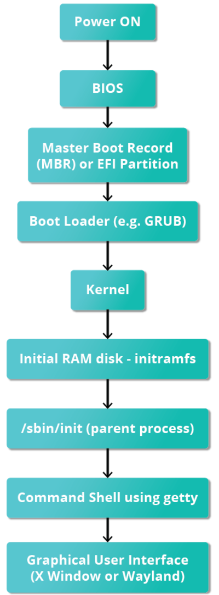
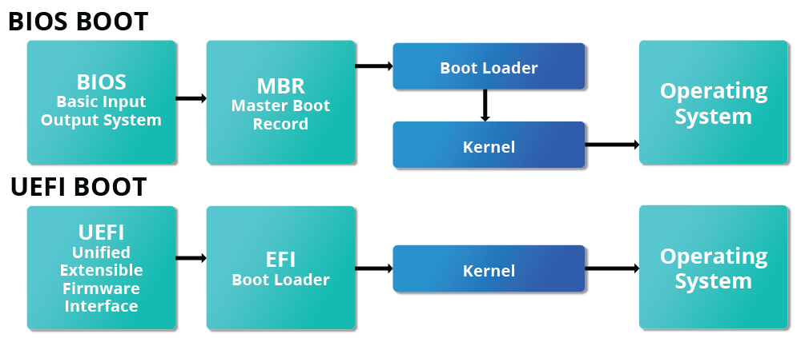
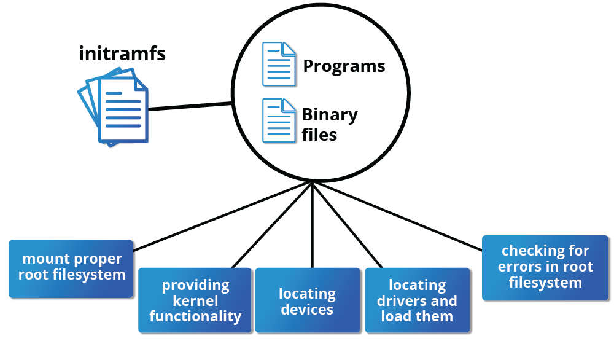

# The Boot Process

## Bios
- Basic Input/Output System
- The first step
- Is stored on a read-only-memory (ROM) chip on the motherboard
- After, the boot process in controlled by the OS

## Boot Loader
- Usually stored on the storage device
- In the boot sector (BIOS/MBR systems) or EFI partition
- Keeps track of the date and time even when the power is off
- most common boot loaders are `GRUB` and `ISOLINUX`
- Responsible for loading the kernel image and the initial RAM disk or filesystem
- Responsible for launching Linux

- The size of the MBR is 512 bytes

## The Initial RAM Disk

- The initramfs filesystem imagem contains programs and binary files that perform all actions nedded to mount the proper root fylesystem

