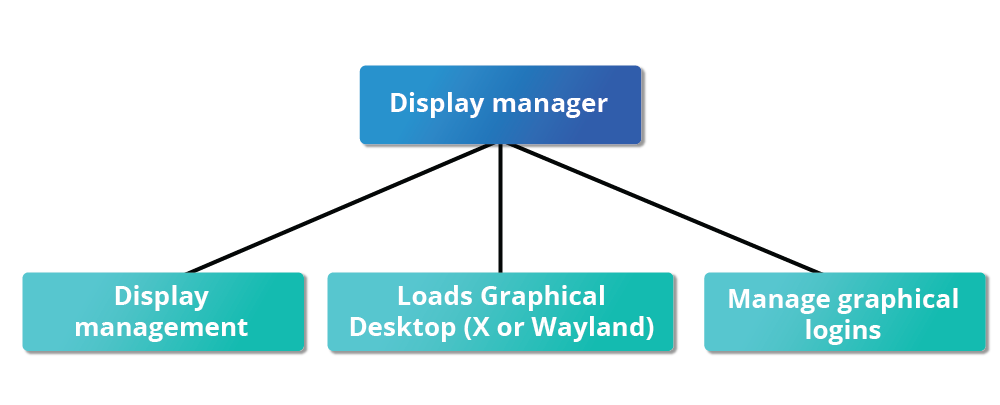

# X Window System

- A service called the `Display Manager` keeps track o the displays being provided and loads the X server.
- Handles graphical logins and starts the appropriate desktop environment after a user logs in.

- `Wayland` is superseding the X 

- If the display manager isn't started, the user can start the grahphical desktop in text-mode console running _`startx`_ from the command line
- The default display for `GNOME` is called *`gdm`*
- The `gdm` display manager presents the user with the login screen, which prompts for the login username and password.

# GNOME Desktop Environment

- Default desktop environment for most Linux distributions
- Can be different across distributions
- The default text editor in `GNOME` is `gedit`

# gnome-tweaks

- A tool to install extensions and third-parties into the Linux
- Has a lot of utilities 
- Run by hitting `ALT F2` and then typing the name
- Sometimes replaced by `gnome-extensions-app`
