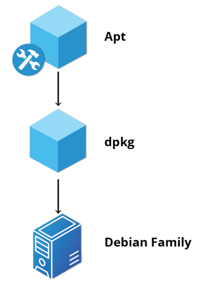
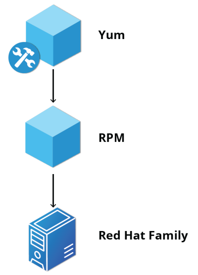
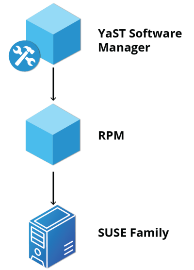

# Debian Packaging

- `dpkg` is the underlying package manager for these systems   
- Can install, remove and build packages
- Doesn't download automatically packages and satisfy their dependencies
- The higher-level package management system is the `Advanced Package Tool (APT)`
    - It creates its own user interface on top of it
        - Ex: `apt, apt-get, synaptic, gnome-software, Ubuntu Software Center, etc...`

# Red Hat Package Manager (RPM)

- The higher-level package manager differs between distributions
    - Red Hat family distributions historically use `RHEL/CentOS`
    - Fedora uses `dnf`
    - SUSE family distributions such as openSUSE also use `RPM` but use the `zypper interface`.

# openSUSE’s YaST Software Management

- `Yet another Setup Tool (YaST)`
- RPM-based application 
- To acess the YaST software manager: 
    1. Click Activities
    2. In the Search box, type "YaST"
    3. Click the YaST icon
    4. Click Software Management

