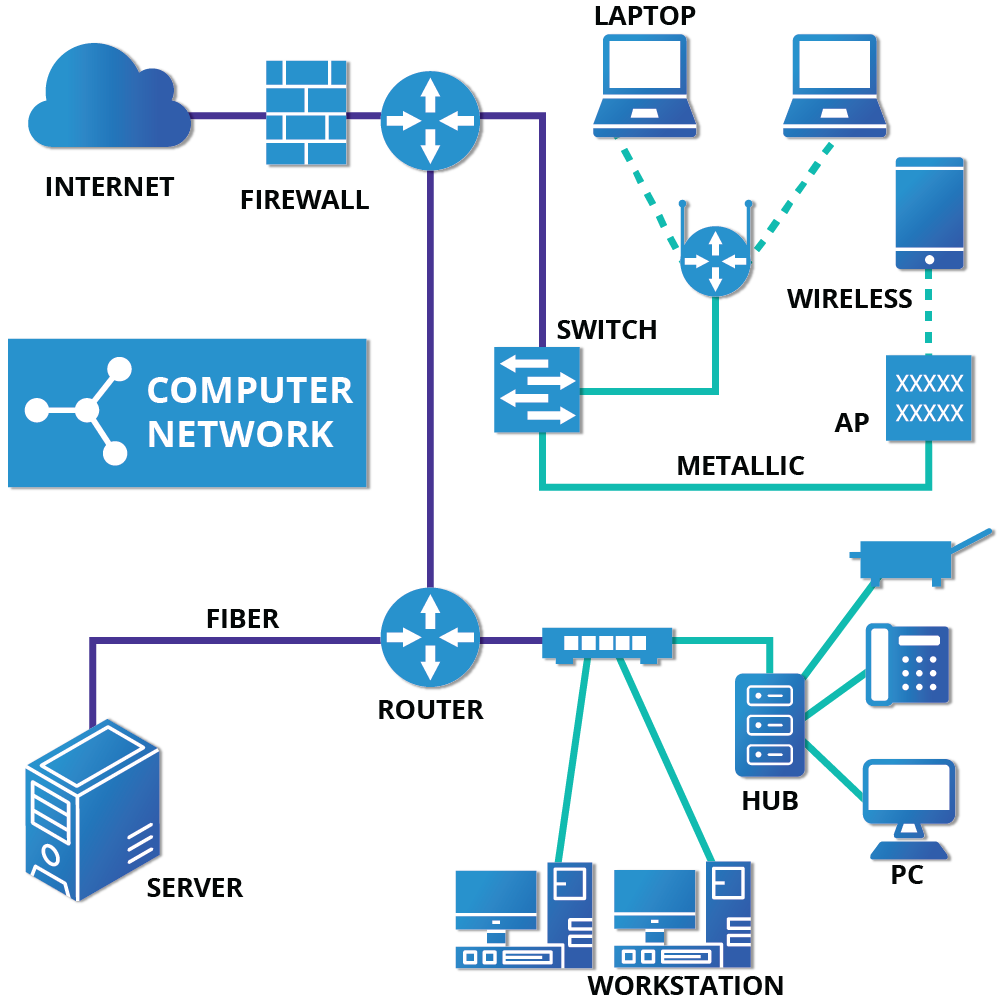

# Wired and Wireless Connections

- The hardware interface and signal presence are automatically detected
- Network Manager sets the actual network settings via `DHCP (Dynamic Host Configuration Protocol)`
- `Network Time Protocol (NTP)` is used to set the local time via internet server

- For static configurations that do not use DHCP, manual setup can be done through Network Manager. You can change the `Ethernet Media Access Control (MAC)` address if your hardware supports it. The MAC address is a unique hexadecimal number of your network card.

# Mobile Broadband and VPN Connections

- You can set up a mobile broadband with Network Manager
- The network is automatically configured 
- It supports many VPN technologies, such as native `IPSec`, `Cisco OpenConnect (via either the Cisco client or a native open source client)`, `Microsoft PPTP` and `OpenVPN`.

