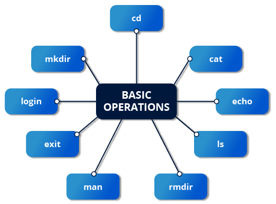

# Logging In and Out

- A terminal will prompt for a `login: ` and a `password: ` so you can perform basic operations
- Can also connect via remote system  using `Secure SHell (SSH)` 
    - Ex: `ssh student@remote-server.com` 
- `SSH` would connect to the remote machine `(remote-server.com)` and give `student` a command line window to sign in

# Rebooting and Shutting Down

- Preferred to shut down using the `shutdown` command to shut down properly
- The `init` will then take over the process
- The `halt` and `poweroff` commands issue `shutdown -h` to halt the system
- `reboot` issues `shutdown -r` 
- Requires root privileges
- When administering a multi-user system, you have the option of notifying all users prior to shutdown, as in:

```bash
$ sudo shutdown -h 10:00 "Shutting down for scheduled maintenance."
``` 

# Locating Applications 

- In general, executable programs live in `/bin, /usr/bin, /sbin, /usr/sbin` directories or in `/opt`
- Can also be in `/usr/local/bin` and `/usr/local/sbin` or `/home/student/bin`
- One way to locate the program is by using the `which` command

```bash
$ which diff
/usr/bin/diff
```

- Can also use the `whereis` command for deeper search

```bash
$ whereis diff
diff: /usr/bin/diff /usr/share/man/man1/diff.1.gz /usr/share/man/man1p/diff.1p.gz
```

# Acessing Directories 

- You can see the location of your home directory by typing `echo $HOME` 
- Most distributions open in `echo $HOME/Desktop`

- Commands useful for directory navigation: 

| COMMAND | RESULT |
| :--- | :--- |
| `pwd` | Displays the present working directory |
| `cd ~` or `cd` | Change to your home directory; shortcut name is ~ (tilde) |
| `cd ..` | Change to parent directory (..) |
| `cd -` | Change to previous working directory; - (minus) |

# Absolute and Relative Paths

- `Absolute Pathname`
    - Begins with the root directory (/) and follows the tree, branch by branch, until it reaches the desired directory or file. Absolute paths always start with /.
- `Relative Pathname`
    - Starts from the present working directory. Relative paths never start with /.


# Exploring the Filesystem

- `tree` command to visualize the filesystem tree, `tree -d` to view just the directories

- Useful commands: 

|Command |	Usage |
| :--- | :--- |
`cd /`	| Changes your current directory to the root (/) directory (or path you supply) |
`ls`	| List the contents of the present working directory |
`ls -a` | List all files, including hidden files and directories (those whose name start with .) |
`tree` | Displays a tree view of the filesystem |

# Hard Links

- The `ln` creates hard links and soft links with `ln -s` aka `symlinks`
- Suppose that file1 already exists. A hard link, called file2, is created with the command:
```bash
$ ln file1 file2
```
- Inspecting with: 
```bash
$ ls -li file1 file2
```
- The -i option to ls prints out in the first column the inode number, which is a unique quantity for each file object
- It is only one file, but it has more than one name associated with it, as is indicated by the 2 that appears in the ls output


- A Hard Link is not a copy but a pointer to the `inode (index node)` of an existent file
- Every hard link entry has the same data in the disk, changing one make changes in the others
- The file is only deleted when every `inode` is deleted 

# Soft (Symbolic) Links

- Soft (or Symbolic) links are created with the -s option: 
```bash
$ ln -s file1 file3
$ ls -li file1 file3
```

- file3 no longer appears to be a regular file, and it clearly points to file1 and has a different inode number.


- Symlinks don't take extra space on the filesystem
- Can be easily modified to point to different places   
- Can be used to create a shortcut to long pathnames
- Can point to different filesystems, partitions and disks
- If pointed to a non existent filesystem, creates a `dangling link`

# Navigating Through Directory History 

- Using `pushd` to change directory will remember more than the last one visited
- Using `popd` will get you to those directories in reverse order
- The list made with `pushd` will be displayed with `dirs`
