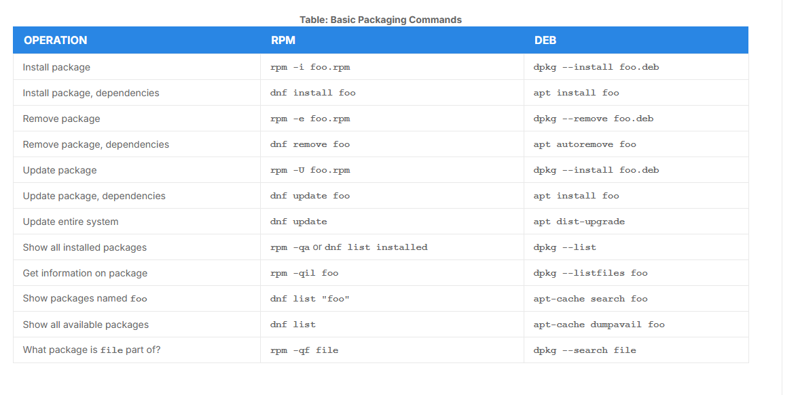

# Package Managers: Two Levels

- Every package management system operate on two distinct levels: 
    - A low-level tool (`dpkg` or `rpm`) takes care of the details of unpacking individual packages, running scripts, getting the software installed correctly
    - A high-level tool (`apt`, `dnf` or `zypper`) works with groups of packages, downloads packages from the vendor, and figures out dependencies.

# Working With Different Package Management Systems

- The *Advanced Packaging Tool* (`apt`) manages the software on Debian
    - Native at the CLI
- `dnf` manages the software on *Red Hat Family*   
- `zypper` manages the software on *SUSE/openSUSE*, it also allows you to manage repositories from the CLI, resembles `dnf`

- The basic packaging commands for each manager:

