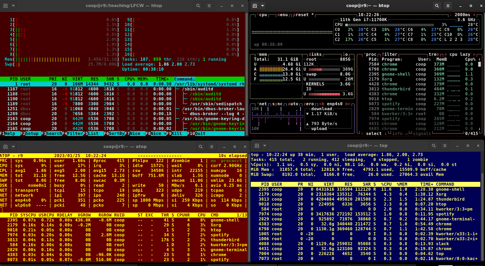

# The **ps** Command (System V Style)

- `ps` (Process Status) provides information about currently running processes by PID
- To have periodic update of this status, use (`top, htop, atop or btop`)
- `ps` will display all processes running under the current shell
- `ps -ef` displays all the processes in the system in full detail
- `ps - eLf` displays one line of information for every thread

# The **ps** Command (BSD Style)

- BSD variety of UNIX doesn't use preceding dashes 
    - `ps aux` displays all processes of all users
    - `ps axo` allows you to specify which attributes you want to view

- `pstree` displays the process running in the form of a tree diagram
    - Threads are displayed in curly braces
    - Repeated entries are not displayed

# top

- `top` gives constant real-time updates of the processes
    - Every two seconds by default
- Exit with `q.top`

- The first line of the `top` output displays a quick summary of what is happening in the system:
    - How long the system has been up
    - How many users are logged on
    - What is the load average

- The second line of `top` output displays:
    - The total number of processes
    - The number of running, sleeping, stopped and zombie processes

- Third line of the `top` output indicates how the CPU time is being divided between users 
    - `us` - users
    - `sy` - kernel
    - `ni` - niceness
    - `id` - idle mode
    - `wa` - waiting processes
    - `hi` - hardware interrupts
    - `si` - software interrupts
    - `st` - steal time

- Fourth and fifth line indicate memory usage, which is divided in two categories: 
    - Physical memory (RAM) – displayed on line 4.
    - Swap space – displayed on line 5.
    - Both categories display total memory, used memory and free space

- The process list of the `top` output displays the following information about each process:
    - Process Identification Number (`PID`)
    - Process owner (`USER`)
    - Priority (`PR`) and nice values (`NI`)
    - Virtual (`VIRT`), physical (`RES`), and shared memory (`SHR`)
    - Status (`S`)
    - Percentage of CPU (`%CPU`) and memory (`%MEM`) used
    - Execution time (`TIME+`)
    - Command (`COMMAND`).

# Interactive Keys with **top**

- `top` can be utilized interactively for monitoring and controlling processes

- TABLE: What Happens When Pressing Various Keys When Running top:

|Command	| Output
| :--- | :---
| h or ? |	Display available interactive keys and their function
| t	| Display or hide summary information (rows 2 and 3)
| m	| Display or hide memory information (rows 4 and 5)
| l	| Show information for each CPU and not just totals
| d	| Change display update interval
| A	| Sort the process list by top resource consumers
| r	| Renice (change the priority of) a specific processes
| k	| Kill a specific process
| f	| Enter the top configuration screen
| o	| Interactively select a new sort order in the process list

- There alternatives to `top` with additional capabilities and prettier aspects
- Including:
    - `atop`, `btop` and `htop`:

