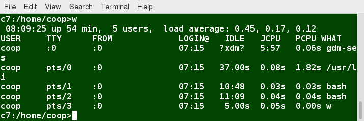

# Load Averages

- The **load average** is the average of the load number for a given period of time. It takes into account processes that are:
    - Actively running on a CPU.
    - Considered runnable, but waiting on the run queue for a CPU to become available.
    - Sleeping: i.e. waiting for some kind of resource (typically, I/O) to become available.

- The load avarage can be viewed by running
    - `w`, `top` or `uptime`

# Interpreting Load Averages

- The load average for a single core CPU is displaying three numbers above:
    - 0.45: For the last minute the system has been 45% utilized on average.
    - 0.17: For the last 5 minutes utilization has been 17%.
    - 0.12: For the last 15 minutes utilization has been 12%.

- For system with more than 1 CPU, we would divide de load avarage by the total CPUs

# Background and Foreground Processes

- You can put a job (terminal command launched) in the background by suffixing `&` to the command
    Ex: `updatedb &`
- Background jobs are executed at lower priority
- When a foreground job is running, other jobs need to wait for shell acess
- You can use `CTRL Z` to suspend a foreground job
- `CTRL C` to terminate it
- `bg` command to run a suspended process in the background
- `fg` command to run a background process in the foreground

# Managing Jobs

- `jobs` displays all jobs running in background
    - The display shows the job ID, state and command name
- `jobs -l` adds the PID too
- `jobs` do not show ones started from other terminal window
