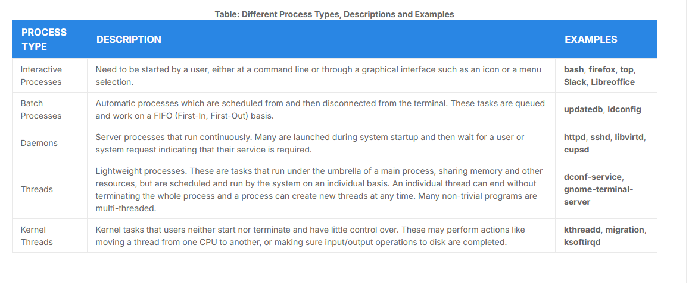

# What Is a Process?

- A **process** is an instance of one or more related tasks (threads) executing on your computer
- Not the same as a **program** or a **command**
- A single command may start several process
- Some processes are independent of each other and others are related
 


- Processes use many resources of the computer, such as CPU cycles, peripheral devices
- The operating system and kernel are responsible for allocating that

- Process Types:


# Process Scheduling and States

- The **scheduler** constantly shifts processes on and off the CPU
- When a process is **running**, is either in **sleep** state or executing instructions to the CPU
- This **sleep** state appear as the process is running, like a zombie state
- All processes reside in a queue, in multiple CPU or cores waiting for its turn


- The OS assign each process a `process ID (PID)`
- They are sorted by order of arrival, so the `init` process is the first and so on

| ID Type | Description
| :--- | :---
| Process ID (PID) | Unique Process ID number.
| Parent Process ID (PPID) | Process (Parent) that started this process. If the parent dies, the PPID will refer to an adoptive parent; on modern kernels, this is kthreadd which has PPID=2.
| Thread ID (TID) | Thread ID number. This is the same as the PID for single-threaded processes. For a multi-threaded process, each thread shares the same PID, but has a unique TID.

- To terminate a process, you can use `kill`
- `kill` can be used to send any signal to a process, not just terminate it
 
```bash
kill -SIGKILL <pid>
kill -9 <pid>
```

# User and Group IDs

- The user who determines the acess rights is the `Effective UID (EUID)`
- The operating system identifies the user who starts the process by the `Real User ID (RUID)`
- Users can be organized into enumerated groups. Each group is identified by the `Real Group ID (RGID).`
- The access rights of the group are determined by the Effective Group ID (EGID)
- Each user can be a member of one or more groups


# Priorities

- The CPU accommodates one task at a time, so Linux allows the user to manipulate a priority process
- Can be set by defining a `nice value`, the lower the nice value, the higher the priority
- Higher priority processes get preferential access to the CPU.

```bash
renice +5 3077
```
- Increase the process 3077 **nice value** to 5
