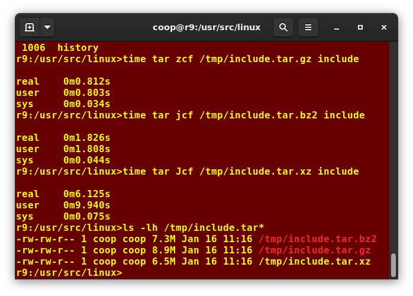

# Backing Up Data

- Can be using `cp` or `rsync`, but `rsync` is more efficient

## Using `rsync`

- `rsync` checks if the file already exists and only make the necessary changes
- It copies only the parts of files that have actually changed

```bash
$ rsync -r project-X archive-machine:archives/project-X
```

- If typed `rsync sourcefile destinationfile`, the contents of `sourcefile` will be copied to `destinationfile`

```bash
$ rsync --progress -avrxH  --delete sourcedir destdir
```

# Compressing Data

- Compressed data is used to save space disk and reduce time to transmit over network

- Methods to perform compression:

|Command | 	Usage
| :--- | :---
| `gzip`	| The most frequently used Linux compression utility
|`bzip2` |	Produces files significantly smaller than those produced by gzip
|`xz`	| The most space-efficient compression utility used in Linux
|`zip` |	Is often required to examine and decompress archives from other operating systems

- The `tar` utility is used to group files in an archive and the compress the arquive

## Compressing Data Using `gzip`

- `gzip` usage examples:

| Command | Usage
| :--- | :---
| `gzip *` |	Compresses all files in the current directory; each file is compressed and renamed with a .gz extension.
| `gzip -r projectX` |	Compresses all files in the projectX directory, along with all files in all of the directories under projectX.
| `gunzip foo` |	De-compresses foo found in the file foo.gz. Under the hood, the gunzip command is actually the same as gzip –d.

## Compressing Data Using `bzip2`

- `bzip2` uses the same algorithm as `gzip` and produces smaller files
- Takes longer because of that
- `bzip2` usage examples:

| Command |	Usage
| :--- | :---
| `bzip2 *` |	Compresses all of the files in the current directory and replaces each file with a file renamed with a .bz2 extension.
| `bunzip2 *.bz2` |	Decompresses all of the files with an extension of .bz2 in the current directory. Under the hood, bunzip2 is the same as calling bzip2 -d.

## Compressing Data Using `xz`

- `xz` is the most space-efficient compression utility
- Its the one that takes longer to compress
- Generally used in large files

- `xz` usage examples:

| Command |	Usage
| :--- | :--- 
|`xz *` |	Compresses all of the files in the current directory and replaces each file with one with a .xz extension.
| `xz foo` |	Compresses foo into foo.xz using the default compression level (-6), and removes foo if compression succeeds.
|`xz -dk bar.xz` |	Decompresses bar.xz into bar and does not remove bar.xz even if decompression is successful.
| `xz -dcf a.txt b.txt.xz > abcd.txt` |	Decompresses a mix of compressed and uncompressed files to standard output, using a single command.
| `xz -d *.xz` |	Decompresses the files compressed using xz.

## Compressing data using `zip`

- Rarely used for compressing data
- Only used when you get a file from Windows or the Internet
- Not fast and not efficient

- `zip` usage examples:

| Command |	Usage
| :--- | :---
| `zip backup *` |	Compresses all files in the current directory and places them in the backup.zip.
| `zip -r backup.zip ~` |	Archives your login directory (~) and all files and directories under it in backup.zip.
| `unzip backup.zip` | Extracts all files in backup.zip and places them in the current directory.

## Archiving and Compressing Data Using `tar`

- Stood for **t**ape **a**rchive, used to archive files to a magnetic tape
- Allows to create or extract files from an archive file
- Optionally compress while creating the archive and decompress while extracting its contents


- Can separate out the archiving and compression stages:

```bash
$ tar cvf mydir.tar mydir ; gzip mydir.tar
$ gunzip mydir.tar.gz ; tar xvf mydir.tar
```

- But this is slow and waste space

## Relative Compression Times and Sizes



# Disk-to-Disk Copying (`dd`)

- Very useful for making copies of raw disk space

```bash
dd if=/dev/sda of=sda.mbr bs=512 count=1
```
- That makes a copy of the *MBR*

- Typing:
```Bash
dd if=/dev/sda of=/dev/sdb
```

- Will delete everything that previously existed on the second disk
- It can erase a hard disk so it has to be carefully executed

