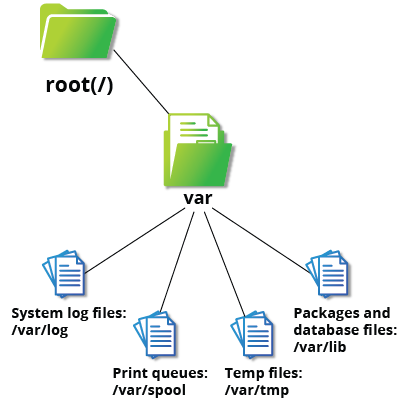
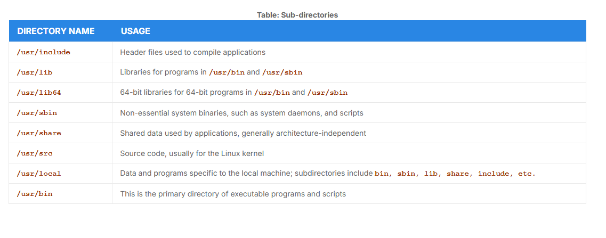

# Overview of User Home Directories

- Each user has a home directory, usually at `/home`
- Formerly `/root`
- On multi-user systems, the `/home` directory may be mounted on its own partition or on a NFS
 

## The `/bin` and `/sbin` Directories

- The `/bin` directory contains:
    - Executable binaries
    - Essential commands used to boot the system 
    - Commands required by all system users such as: `cat, cp ls mv, ps and rm`

- The `sbin` directory is intended for binaries related to system administration
    - Such as `fsck` and `ip`

- In many distributions today, `/usr/bin` and `/bin` are symbollically linked together

## The `/proc` Filesystem

- Filesystems mounted at `/proc` are **pseudo-filesystem**, they don't have permanent 
presence anywhere on the disk
- The `/proc` contains files that exist only in memory
- It doesn't contain real files, but runtime system information:
    - System memory
    - Devices mounted
    - Hardware configuration, etc

## The `/dev` Directory

- The `/dev` directory contains **device nodes**, a type of pseudo-file used by most hardware and software devices
- This directory is:
    - Empty on the disk partition when it's not mounted
    - Contains entries created by the **udev** system
    - That manages and creates device nodes
    - Creating them dynamically when devices are found
    - The `/dev` directory contains:
        1. `/dev/sda1` (first partition on the first hard disk)
        2. `/dev/lp1` (second printer)
        3. `/dev/random` (a source of random numbers).

## The `/var` Directory

- The `/var` directory contains files that change in size and content as the system is running (variables)
- Such as:
    - System log files: `/var/log`
    - Packages and database files: `/var/lib`
    - Print queues: `/var/spool`
    - Temporary files: `/var/tmp`

## The `/etc` Directory 

- The `/etc` directory is the home for system configuration files
- It contains no binary files
- Is for system-wide configuration files and only sudo can modify them

## The `/boot` Directory 

- The `/boot` directory contains essential files need to boot the system
- For every alternative kernel installed there are four files:
    - `vmlinuz`: The compressed Linux kernel, required for booting
    - `initramfs`: The initial rama filesystem, required for booting
    - `config`: The kernel configuration file for debugging and bookkeeping
    - `System.map`: Kernel symbol table used for debugging
- Each of these files has a kenrel version appended to its name
- The `GRUB (Grand Unified Bootloader)` also are found under the `/boot` dir

## The `/lib` and `lib64` Directories

- The `/lib` directory contains libraries for the essencial program in `/bin` and `/sbin`
- They are called dynamically loaded libraries (aka shared libraries or Shared Objects (SO))
- In some distributions there are `/lib64` and `/lib32` directories
- Kernel modules are located in `/lib/modules/<kernel-version-number>.`

## The `/media`, `/run` and `/mnt` Directories

- Any removable media is automatically mounted when the system notices something has bee plugged in
- Modern distributions place these mount points at `/run`
- Formerly `/media`
- The `/mnt` directory is used to temporarily mount filesystems
    - So called **loopback**, files that pretend to be partitions

## Additional Directories Under /

|Directory Name     | Usage
| :---: | :---
| `/opt`	| Optional application software packages
| `/sys`	| Virtual pseudo-filesystem giving information about the system and the hardware. Can be used to alter system parameters and for debugging purposes
| `/srv`	| Site-specific data served up by the system. Seldom used
| `/tmp`	| Temporary files; on some distributions erased across a reboot and/or may actually be a ramdisk in memory
| `/usr`	| Multi-user applications, utilities and data

## The `/usr` Directory Tree

- The /usr directory tree contains theoretically non-essential programs and scripts and has at least the following sub-directories:

