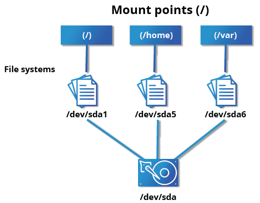
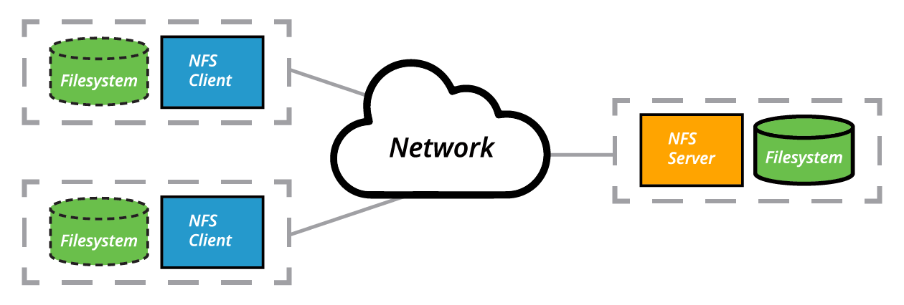

# Introduction to Filesystems

- "Everything is a file" dealing with all types of things in UNIX-based systems proceeds through the same I/O operations
- The filesystem is structured like a tree
- Starts at the **root directory** denoted by `/`

## Filesystem Varieties

- Linux supports a number of native filesystem types, expressly created by Linux developers, such as:
   - `ext3`
   - `ext4`
   - `squashfs`
   - `btrfs`
- It also offers implementations of filesystems used on other alien operating systems, such as those from:

  -  Windows (`ntfs, vfat, exfat`)
   - SGI (`xfs`)
    - IBM (`jfs`)
   - MacOS (`hfs`, `hfs+`)
    - `FAT`
- A machine can have more than one filesystem
- Linux also makes use of network filesystems besides `NFS` such as:
    - `Ceph`
    - `Lustre`
    - `OpenAFS`

# Linux Partitions 

- Each filesystem occupies a disk **partition**
- Partitions help to organize contents of disks according to the data contained
    - Files that the system is run in are kept on a separate partition, the `root` or `/`
- When a data is corrupted, the system may be run normally because of partitions

# Mount Points

- Before you can start using a filesystem, you need to mount it on the tree at a mount point
- These is a directory that the filesystem will attach to 



- These directories need to be empty

# Mounting and Unmounting

- The `mount` command is used to attach a filesystem
- The basic arguments are the `device node` and mount point

```bash
$ sudo mount /dev/sda5 /home
```

- will attach `/dev/sda5` to the `home` mount point     
- can also use the disk `label` or `UUID (Universally Unique Identifier)`

- To unmount the partition:

```bash
$ sudo umount /home
```

- `mount` without any arguments shows all mounted filesystems
- `df -Th` will display information about mounted filesystems and usage statistics
- entries of `tmpfs` are parts of system memory 

# NFS and Network Filesystems

- A network filesystem may have all its data on one machine or have it spread out on more than one network **node**
-  A network filesystem can be thought of as a grouping of 
lower-level filesystems of varying types.



- Users in a remote mounted home directories can still acess the same files across multiple systems
- The most common filesystem is `NFS (Network Filesystem)` developed by *Sun MicroSystems*
    - `CIFS (SAMBA)` is another common implementation

# NFS on the Server

- `NFS` uses `daemons` built-in networking and service processes in Linux

```bash
$ sudo systemctl start nfs
```

- `/projects *.example.com(rw)` this entry allows the directory `/projects` to be mounted using `NFS` with read and write permissions
- There are three possibles permissions:
    - `r` read
    - `w` write
    - `x` execute

- After modifying the `/etc/exports` file, you can type `exportfs -av` to notify Linux about the directories you are allowing to be remotely mounted using `NFS`.

- You can also restart `NFS` with:

```bash
$ sudo systemctl restart nfs
```

- To make sure the `NFS` service starts whenever the system is booted

```bash
$ sudo systemctl enable nfs
```

# NFS on the Client

- On the client machine, if it is desired to have the remote filesystem mounted automatically upon system boot, `/etc/fstab` accomplish this

```bash
servername:/projects /mnt/nfs/projects nfs defaults 0 0
```

- You can also mount the remote filesystem without a reboot or as a one-time mount by directly using the mount command:

```bash
$ sudo mount servername:/projects /mnt/nfs/projects
```

- Remember, if `/etc/fstab` is not modified, this remote mount will not be present the next time the system is restarted. Furthermore, you may want to use the nofail option in `fstab` in case the `NFS` server is not live at boot.