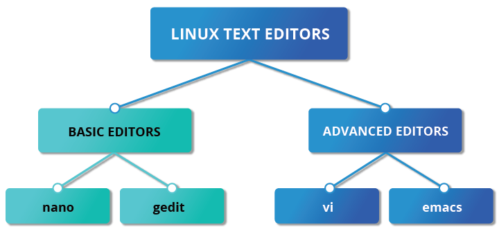

# Overview of Text Editors in Linux

- The most used basic editors in Linux are:
    - `nano`
    - `gedit`
- The most used complex editors in Linux are:
    - `vi`
    - `emacs`
- Another popular but very graphical is:
    - `Visual Studio Code` or simply `code`



# Creating Files Using an Editor

- There are two standard ways to create a file from the CL 
- First is to use `echo`:

```bash
$ echo line one > myfile
$ echo line two >> myfile
$ echo line three >> myfile
```

- A single greater than sign `(>)` will send the output to a command file
- A double greater than sign `(>>)`will append the new output to an existing file

- Second way is to use `cat` 
```bash
$ cat << EOF > myfile
> line one
> line two
> line three
> EOF
$
```

## `nano` and `gedit`

- Pretty simple and obvius text editors
- Similar to Notepad on Windows

### `nano`

- To open a file, type `nano <filename>` and press enter
- If the file doesn't exist, will be created
- `nano` provides a shortcut at the end of the screen which includes:
    - `CTRL-G`
    Display the help screen.
    - `CTRL-O`
    Write to a file.
    - `CTRL-X`
    Exit a file.
    - `CTRL-R`
    Insert contents from another file to the current buffer.
    - `CTRL-C`
    Show cursor position.


### `gedit`

- More capable than Notepad but similar
- To open a file, type `gedit <filename>` and press enter
- If the file doesn't exist, will be created
