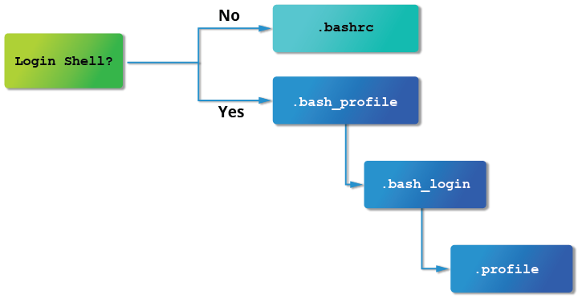

# Identifying the Current User

- `whoami` to identify current user
- `who` to list the current logged in users
    - `who -a` to get more detailed information 

# User Startup Files

- The command shell program uses one or more startup files to configure the user environment
- The startup files can do anything the user would like to
    - Customizing the prompt
    - Defining command line shortcuts and aliases
    - Setting the default text editor
    - Setting the path for where to find executable programs

# Order of Startup Files

- When you first startup, `/etc/profile` is read and evaluated
- After, the following files are searched:
    1. `~/.bash_profile`
    2. `~/.bash_login`
    3. `~/.profile`
- If it finds `~/.bash_profile`, it ignores the rest
- This may change in other distributions
- Everytime you create a new shell, `~/.bashrc` file is evaluated



# Creating Aliases

- Aliases are customized commands of already existing ones
- Aliases are placed at `~./bashrc`
- `unalias` removes an alias
- `alias` will list current defined aliases

# Basics of Users and Groups

- Users are assigned a unique user ID **(uid)**, which is just an integer; normal users start with a uid of 1000 or greater.
- Groups are collection of accounts with certain shared permissions
- `/etc/group` file is where its administered
- Users also have one or more group IDs **(gid)**
    - These numbers are associated in `/etc/passwd` and `/etc/group`

# Adding and Removing Users

- Adding is done with `useradd` and removing with `userdel`

```bash
$ sudo useradd bjmoose
```

- By default, sets the home directory to `/home/bjmoose`, populates it with some basic files copied from `/etc/skel` and adds a line to `/etc/passwd` such as:
    - `bjmoose:x:1002:1002::/home/bjmoose:/bin/bash`
- and sets the default shell to `/bin/bash`.
- Removing the user keeps the `/home/bjmoose` directory
- `userdel -r` removes everything

# Adding and Removing Groups

- Adding a new group is done with `groupadd`:

```bash
$ sudo /usr/sbin/groupadd anewgroup
```

- The group can be removed with:

```bash
$ sudo /usr/sbin/groupdel anewgroup
```

- Adding a user to an already existing group is done with `usermod`:

```bash 
$ groups rjsquirrel
rjsquirrel : rjsquirrel

$ sudo /usr/sbin/usermod -a -G anewgroup rjsquirrel

$ groups rjsquirrel
rjsquirrel: rjsquirrel anewgroup
```

- `-a` option for appending
- `-g` option to change group IDs
- `-n` to name or rename 

- Removing a user from the group, first you get a complete list of groups:

```bash
$ sudo /usr/sbin/usermod -G rjsquirrel rjsquirrel

$ groups rjsquirrel
rjsquirrel : rjsquirrel
```

# The **root** account

- Often called superuser account
- You can use sudo to assign more limited privileges to user accounts:
    - Only on a temporary basis
    - Only for a specific subset of commands.

# **su** and **sudo**

- `su` is for switch substitute user
- Launches a new shell running as another user

# Elevating to **root** Account

- To temporarily become the superuser for a series of commands, you can type `su` and then be prompted for the root password.
- To execute just one command with root privilege type `sudo <command>`. When the command is complete, you will return to being a normal unprivileged user.
- `sudo` configuration files are stored in the `/etc/sudoers` file and in the `/etc/sudoers.d/` directory. By default, the `sudoers.d` directory is empty
