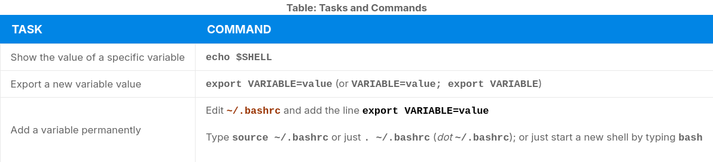
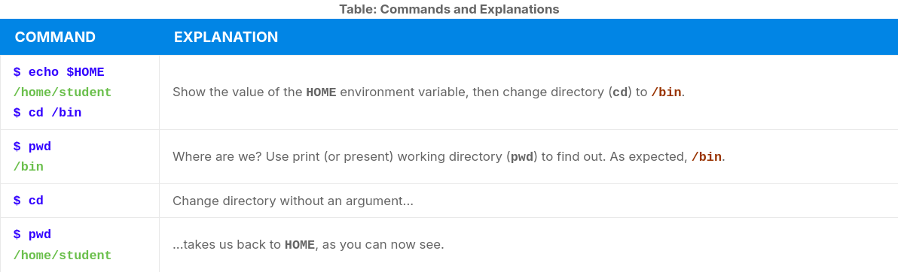

# Environment Variables

- A character string that contains information used by one or more applications
- There are multiple ways to view current set environment variables:
    - `set`
    - `env`
    - `export`

# Setting Environment Variables

- Variables created within a script are only available in the current shell
- `export` allows child processes to see the variables



- Can also set environment variables to be fed as a one shot to a command as in:

```bash
$ SDIRS="s_0*" KROOT=/lib/modules/$(uname -r)/build make modules_install
```

## The `HOME` Variable

- `HOME`is the environment variable of the home directory
- `cd`, `cd HOME` and `cd ~` are the same thing



## The `PATH` Variable

- `PATH` is an ordered list of directories
- Each directory is separated by colon `(:)`, a null directory name or `(./)`
- To prefix a private `bin` directory to your path:

```bash
$ export PATH=$HOME/bin:$PATH
$ echo $PATH
/home/student/bin:/usr/local/bin:/usr/bin:/bin/usr
```

## The `SHELL` Variable

- `SHELL` points to the user's default command shell

```bash
$ echo $SHELL
/bin/bash
$
```

## The `PS1` Variable and the Command Line Prompt

- Prompt Statement (`PS`) is used to customize your prompt string to display the information you want. 
- The following special characters can be included in PS1:
    - `\u` - User name
    - `\h` - Host name
    - `\w` - Current working directory
    - `\!` - History number of this command
    - `\d` - Date

- They must be surrounded in single quotes

```bash
$ echo $PS1
$
$ export PS1='\u@\h:\w$ '
student@example.com:~$ # new prompt
```

- Revert changes:

```bash
student@example.com:~$ export PS1='$ '
$
```
- An even better practice would be to save the old prompt first and then restore, as in:

```bash
$ OLD_PS1=$PS1
```

- change the prompt, and eventually change it back with:

```bash
$ PS1=$OLD_PS1
$
```