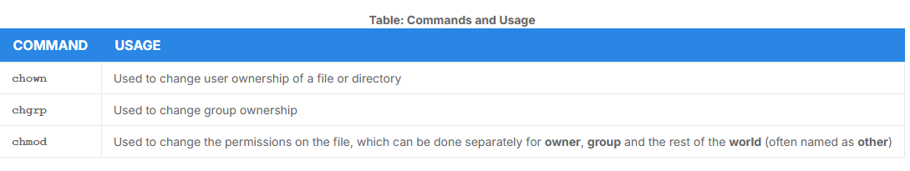
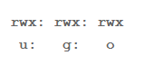
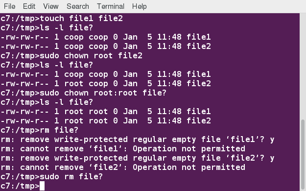

# File Ownership

- Every files is associated with an user and a group that have certain rights or permissions: read write and execute



# File Permission and Modes

- Files have three kinds of permissions:
    - read `(r)`
    - write `(w)`
    - execute `(x)`
- There are three groups that this permissions affect:
    - user/owner `(u)`
    - group `(g)`
    - other `(o)`
- As a result you have following three groups of three permissions:
    - 

- To give the owner and other execute permission and remove the group write permission:

```bash
$ ls -l somefile
-rw-rw-r-- 1 student student 1601 Mar 9 15:04 somefile
$ chmod uo+x,g-w somefile
$ ls -l somefile
-rwxr--r-x 1 student student 1601 Mar 9 15:04 somefile
```

- There is a syntax using digit suffices with the sum of:
    - `4` if read permission is desired
    - `2` if write permission is desired
    - `1` if execute permission is desired
- `7` means read/write/execute
- `6` means read/write
- `5` means read/execute

```bash
$ chmod 755 somefile
$ ls -l somefile
-rwxr-xr-x 1 student student 1601 Mar 9 15:04 somefile
```

## Example of `chown`



## Example of `chgrp`

