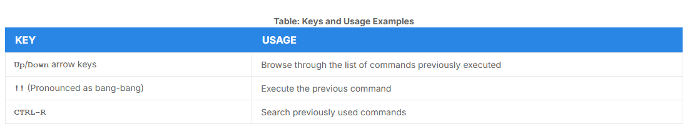
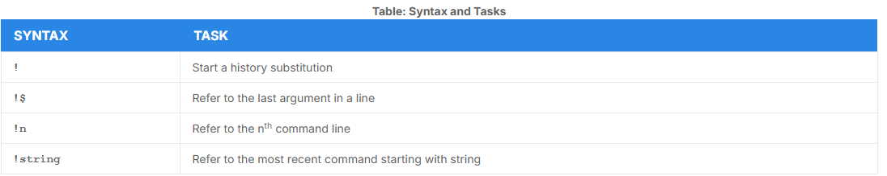
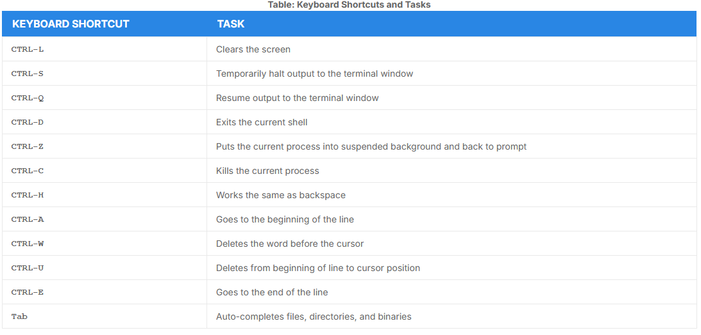

# Realling Previous Commands

- `bash` keeps track of previously entered commands in a history buffer
- `Up` and `Down` arrow keys to visualize
- `history` to see previously executed commands
- This information is stored in `~/.bash_history`

## Using History Environment Variables

- Can be used to get information about the `history` file:
    - `HISTFILE` - The location of the history file
    - `HISTFILESIZE` - The maximum number of lines in the history file
    - `HISTSIZE` - The maximum number of commands in the history file
    - `HISTCONTROL` - How commands are stored
    - `HISTIGNORE` - Which command lines can be unsaved

## Finding and Using Previous Commands



`CTRL-R` example:

```bash
$ ^R
(reverse-i-search)'s': sleep 1000
$ sleep 1000
$ 
```

## Executing Previous Commands



- All history substitutions start with `!`. When typing the command: `ls -l /bin /etc /var`, `!$` will refer to `/var`, the last argument to the command.

```bash
$ history

1 echo $SHELL
2 echo $HOME
3 echo $PS1
3 ls -a
4 ls -l /etc/ passwd
5 sleep 1000
6 history

$ !1
echo $SHELL
/bin/bash

$ !sl
sleep 1000
$
```

## Keyboard Shortcuts



