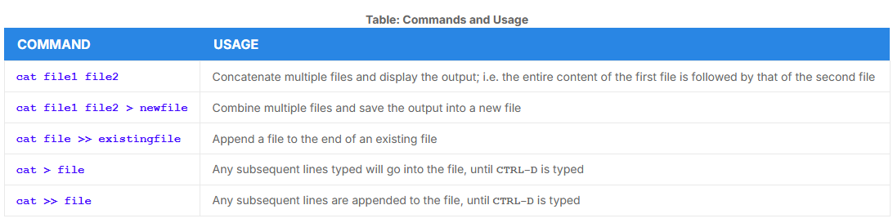
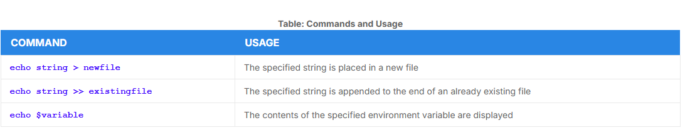
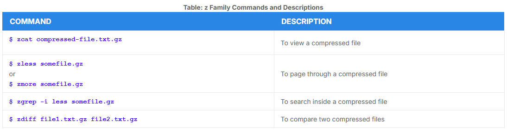
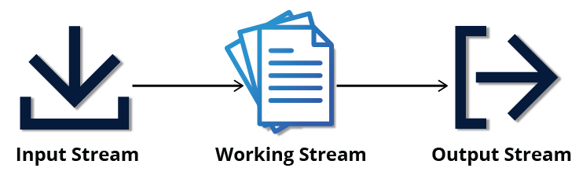
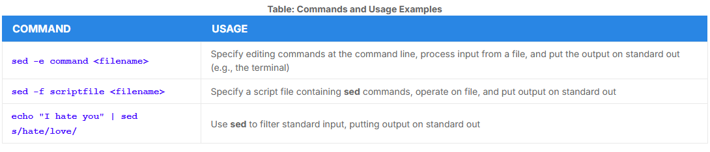
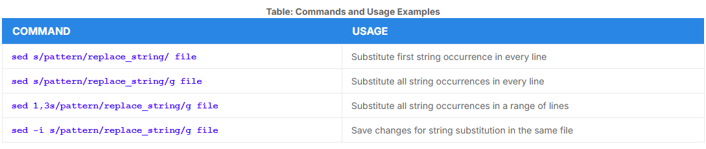
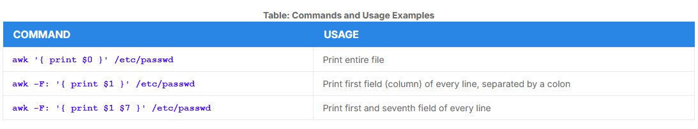

# Command Line Tools for Manipulating Text Files

## `cat` 

- short for **concatenate**
- to view a file, it has the form:

```bash
$ cat <filename> 
```
- its main purpose is to combine multiples files together: 



- `tac`: `cat` spelled backwards is a command to print the lines in reverse order

```bash
$ tac file
$ tac file1 file2 > newfile
```
### Using `cat` interactively

- To create a new file type `cat > <filename>` and press enter
    - After that, the command waits for the user to edit/enter the text
- `CTRL-D` to save and exit the editing

## `echo`

- `echo` simply echoes text 

```bash
$ echo string
string
```

- can be used to append a string to an already existing file using the `>>` operator
- `-e` with `\n` and `\t` is used to enable special character sequences, such as newline and horizontal tab



# Working with Large Files

- `less` used to view contents of a large file without having to use memory

```bash
$ less somefile
$ cat somefile | less
```

## `head`

- `head` reads the first few lines (10) of each named file 
- `-` argument can be used to change number of lines

```bash
$ head -n 5 /etc/default/grub
$ head -5 /etc/default/grub
```

## `tail`

- `tail` prints the last few lines (10) of a file
- `-` argument can be used to change number of lines

```bash
$ tail -n 15 somefile.log
$ tail -15 somefile.log
$ tail -f somefile.log
```

- `-f` is used to continually monitor a file, when changes are made it instantly shows in `tail`

# Viewing Compressed Files

- prefix `z` to commands to view compressed files
- this does not decompress them



---

## `sed`

- used to modifiy the contents of a file or input stream
- stream editor



- `sed` can filter text, as well as perform substitutions in data streams



- some basic operations, where `pattern` is the current string and `replace_string` is the new string:



- `-i` option is irreversible, its best to use the `>` operators

```bash
$ sed s/pattern/replace_string/g file > file2
```

## `awk`

- programming language created in Bell Labs
- has the following features:
    - interpreted 
    - used to manipulate data files, retrieving and processing text
    - works well with fields and records


