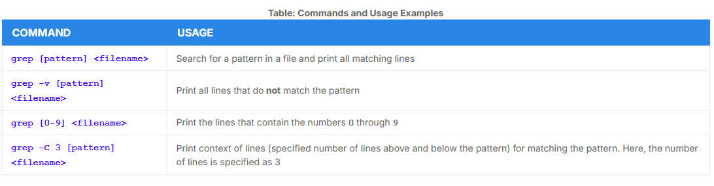
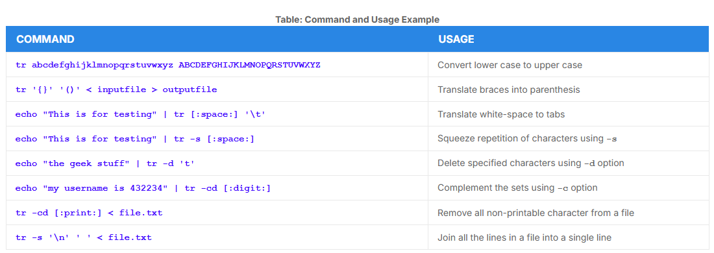

# Text Utilities

## `grep`

- Primary text searching tool
- Scans files for specified patterns and can be used with regular expressions



## `strings`

- Used to extract all printable characters found in the file given

```bash
$ strings book1.xls | grep my_string
```

## `tr`

- changes case of letters or determine the count of words, lines and characters in a file
- used to translate specified characters into other characters 
- has the form: 

```bash
$ tr [options] set1 [set2]
```



## `tee`

- takes the output from any command while sending it to standard output
- one stream is displayed on the standard output and the other is saved to a file

```bash
$ ls -l | tee newfile 
```

- this will display the contents of a directory and save it to a file

## `wc`

- word count, counts the number of lines, words and characters in a file


## `cut`

- used for manipulating column based files 
- extract specific columns 
- to display the third column delimited by a blank space:

```bash
ls -l | cut -d" " -f3
```
