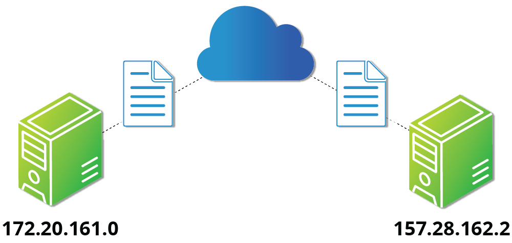
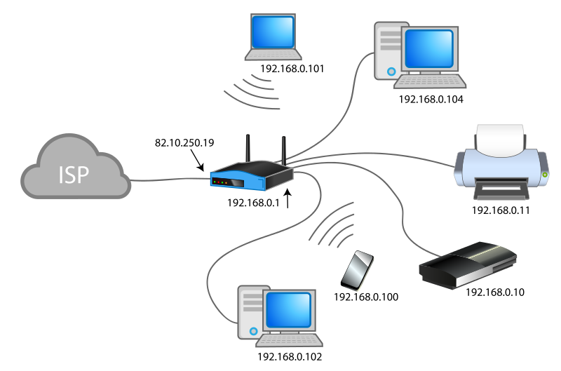
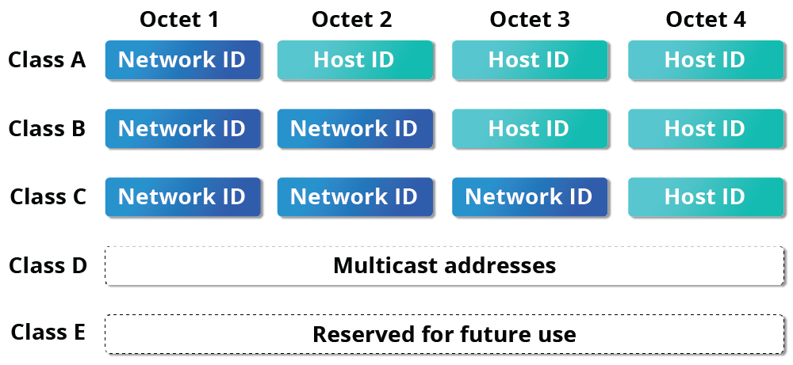
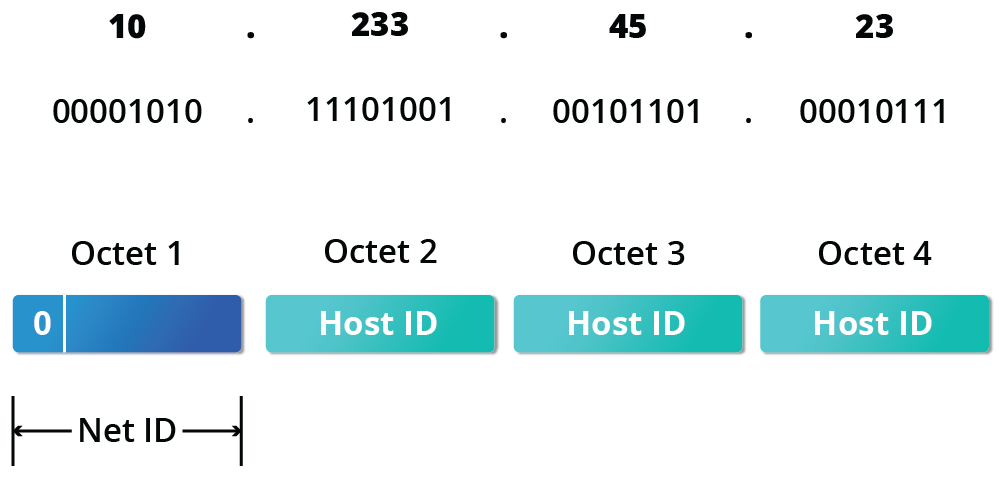
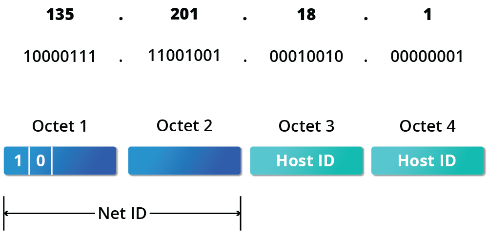
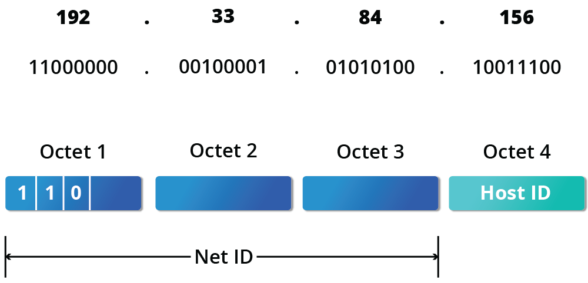
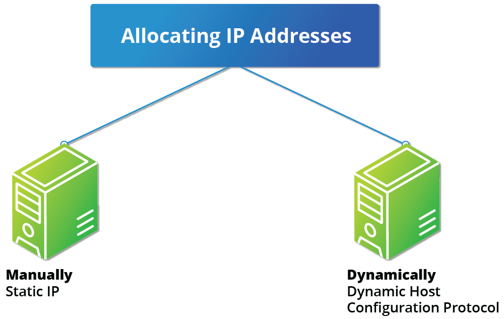

# Introduction to Networking

- Devices connected to a network are called **nodes**
- A network is used to:
    - Allow the connected devices to communicate
    - Enable multiple users to share devices over the network
    - Share and manage information such as databases and file systems across computers

## IP Adresses

- Devices attached to a network must have at least one unique network address identifier know as **IP (Internet Protocol)**
- Exchanging information across the network requires using streams of small packets

## IPv4 and IPv6

- IPv4 uses 32-bits for adresses which allows only 4.3 billion addresses
- IPv6 uses 64-bits for addresses, allowing 3.4 * 10^38 adresses

- IPv4 allows more adresses with NAT (Network Address Translation)
- NAT enables sharing one IP through devices in a same home or organization network 

### Decoding IPv4 Addresses

- A 32-bit IPv4 address is divided into four 8-bit sections called *octets* (bytes)
    - IP Address -> 172.   16.    32.   46
    - Bit format -> 10101100.00010000.00011111.00101110
- Networks are divided into five classes, A-E
    - A, B and C are Net ID (Network Adresses) and Host ID (Host Adress)
        - Net ID is used to identify the network
        - Host ID is used to identify a host in the network
    - Class D is used for special multicast applications
    - Class E is reserved for future use
    

### Class A Network Addresses 

- There is a maximum of 126 Class A networks
- The range of host addresses is from *1.0.0.0* to *127.255.255.255*
- The first octet is for the Net ID and the other 3 for the Host ID

### Class B Network Adresses

- The first two octets are for the Net ID and the other 2 for the Host ID
- The range is from *128.0.0.0* to *191.255.255.255*
- Maximum of 16,384 networks

### Class C Network Adresses

- 2.1 million networks available
- From *192.0.0.0* to *223.255.255.255*
- First three octets for Net ID and 1 for Host ID

## IP Address Location 

- You can assign IP addresses to computers over a network either manually or dynamically
    - Manually assigned adds static address 
    - Dinamically changes everytime you reboot the system

- `hostname` you can view the systems hostname for that IP address