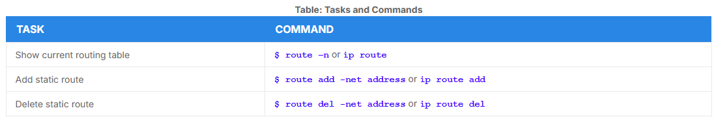
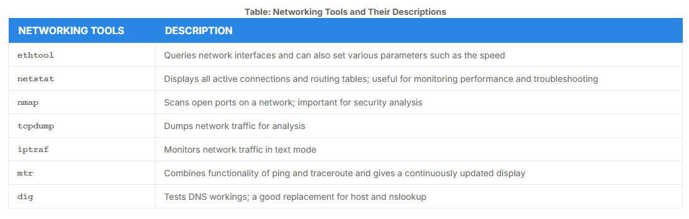

# Network Configuration Files

- Located at `/etc` tree
- Basic network files can be found under
    - Debian - `/etc/network`
    - RedHat and SUSE - `/etc/sysconfig/network`
- `nmtui`, `netplan` and `nmcli` are GUI for network managing

## Network Interfaces

- Conecction channel between a device and a network
- Can proceed through a NIC (Network Interface Card)
- `ip` and `ifconfig` are commands to to report informations about network

### The `ip` Utility

- To view the IP address: 

```bash
$ /sbin/ip addr show
```

- To view the routing information

```bash
$ /sbin/ip route show
```

### `ping`

- To check whether or not a machine attache dto the network can receive and send data
- `ping <hostname>` to check the status of the remote host
- `-c` option limits the number of packets that will be send 

### `route`
 
- Enables routers to build up a forwading table that correlates final destinatinons with the next hop addresses



### `traceroute`

- Used to inspect the route which the data packet takes to reach the destination host
- Isolate connectivity issues between hops
- `traceroute <address>`

## More Networking Tools



## Browsers

- The common graphical browsers in Linux are:
    - Firefox
    - Google Chrome
    - Chromium
    - Konqueror
    - Opera
- The common non-graphical browsers are:
    - lynx
    - elinks
    - w3m

### `wget`

- `wget` handles the following types of downloads
    - large files downloads
    - recursive downloads
    - password-required downloads
    - multiple file downloads

- `wget <url>`

### `curl`

- You can read URLs using:
    - `curl <url>`
- To get the contents of a web page and store it to a file:
    - `curl -o saved.html <url> `