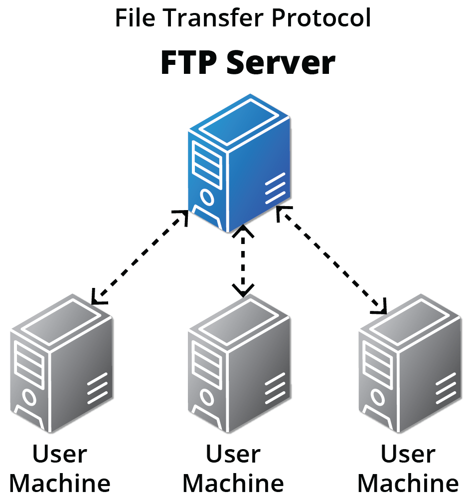
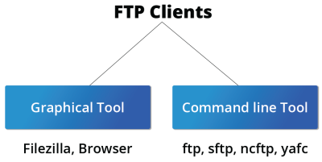
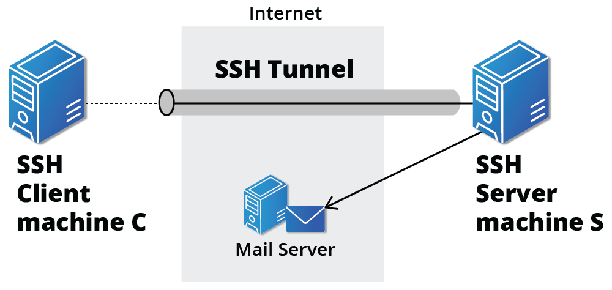
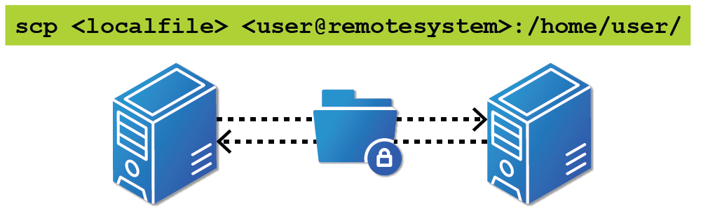

# FPT (File Transfer Protocol)

- A built on client-server model 
- Used when security is not a concern

## FTP Clients

- Enables you to transfer files with remote computers
- Some command lines FPT clients are:
    - `ftp`
    - `sftp`
    - `ncftp`
    - `yafc (Yet Another FTP Client)`

## SSH: Executing Commands Remotely

- Used for secure data communication 
- Used for remote services and other secure services on the network

- `ssh some_system` to login a remote system
- `ssh -l someone some_system` to run as another user

## Copying Files Securely with `scp`

- `scp <localfile> <user@remotesystem>:/home/user` to copy a local file into a remote system

