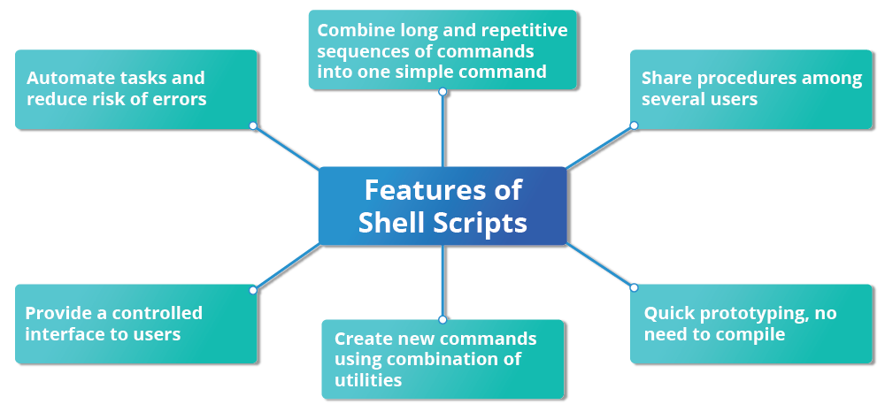

# Shell Scripting



## Command Shell Choices

- The command interpreter is tasked with executing statements that follow it in the script
- Shell scripts are saved in a file and can be shared
- Typical choices of shells are:
    -` /bin/sh`
    - `/bin/bash`
    - `/bin/tcsh`
    - `/bin/csh`
    - `/bin/ksh`
    - `/bin/zsh`

## Shell Scripts

- Typing `find . -name "*.c" -ls"` at the command line is the same as executing a script file containing the lines:

```shell
#!/bin/bash
find . -name "*.c" -ls
```

- `#!` contains the full path of the interpreter
    - called *shebang*

- You can run scripts by typing:
    1. `./hello.sh`
    2. `bash hello.sh`
- `chmod +x hello.sh` makes the file executable for everyone

### Interactive Examples Using `bash` Scripts

[getname.sh](getname.sh)

- The value is stored in a temporarily variable called `name`
- `$` in front of the variable to reference it
- The user is prompted with the string `ENTER YOUR NAME`
- `#` to comment lines

## Return Values

- All shell scripts generate a return value
- Explicitly set with `exit` statement


### Viewing Return Values

- When a script is sucessful, they return a value of 0 and are stored in a environment variable
    - Represented by `$?`

```bash
$ ls /etc/logrotate.conf
/etc/logrotate.conf

$ echo $?
0
```

- When a command is run on a non-existing file, it returns 2