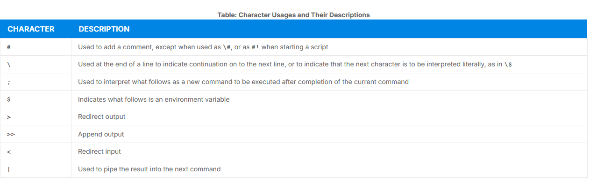
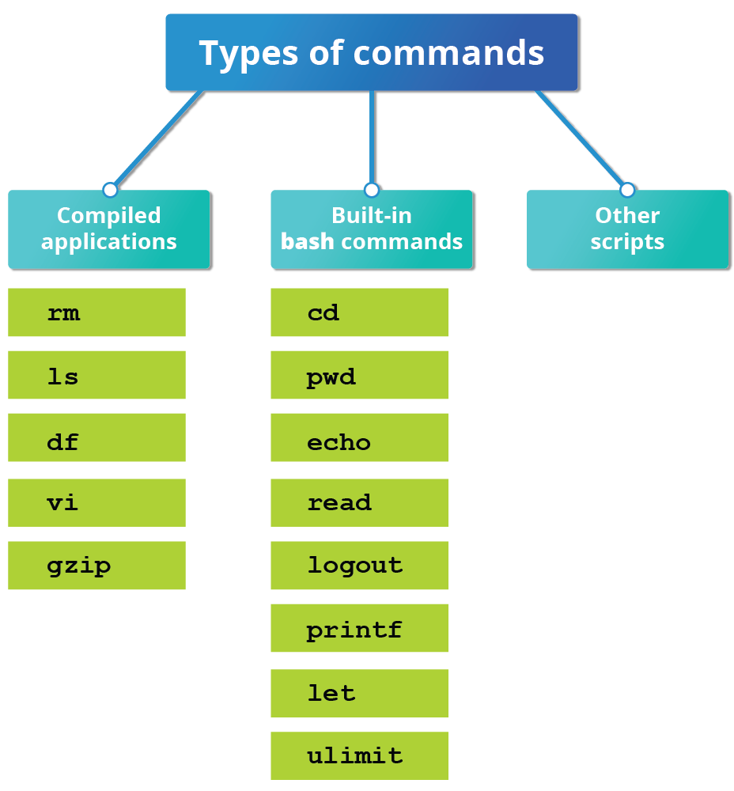
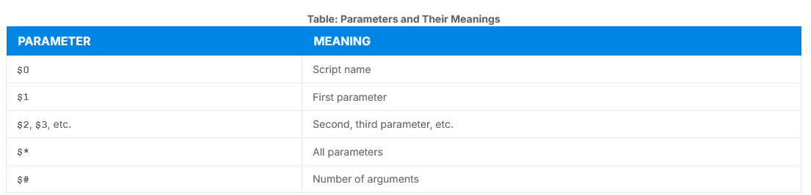
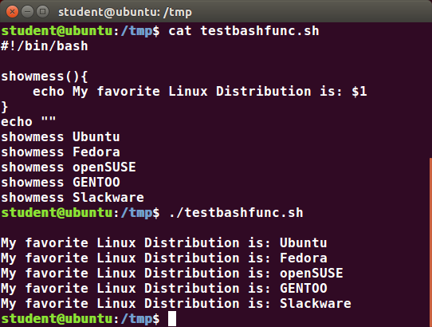
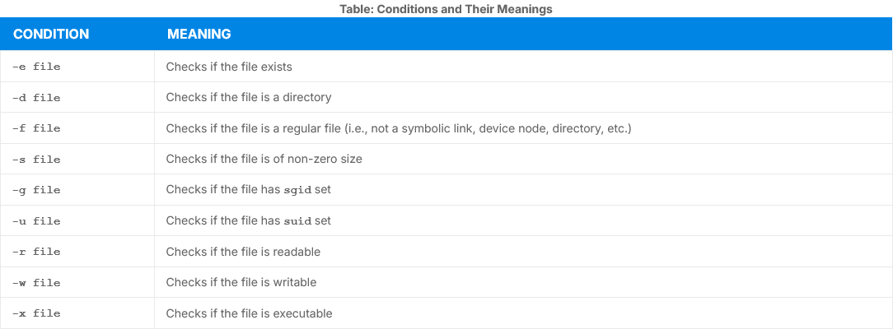
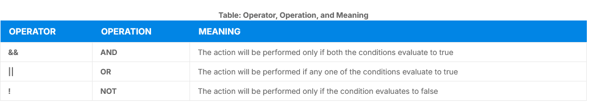
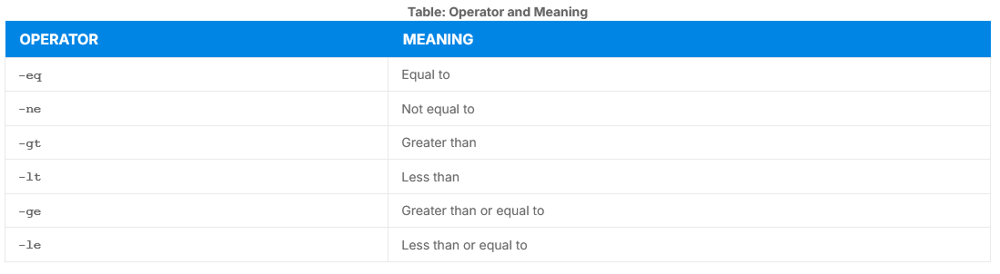

# Basic Syntax and Special Characters

- Special character usages with bash scripts:



## Splitting Long Commands Over Multiple Lines

- The concatenation operator `(\)` is used to continue long commands over several lines

```shell
$~/> cd $HOME
$~/> sudo apt install autoconf automake bison build-essential \
    chrpath curl diffstat emacs flex gcc-multilib g++-multilib \ 
    libsdl1.2-dev libtool lzop make mc patch \
    screen socat sudo tar texinfo tofrodos u-boot-tools unzip \
    vim wget xterm zip 
```

### Putting Multiple Commands on a Single Line

- Chaining commands is possible with:
    - `;` to separate commands and execute them sequentially
    - `&& (and)` to abort subsequent commands when an earlier one fails
    - `|| (or)` to proceed until something succeeds

```shell
$ make ; make install ; make clean
$ make && make install && make clean
$ cat file1 || cat file2 || cat file3
```

## Output Redirection

- `>` to write output to a file

```shell
$ free > /tmp/free.out
```

- `>>` will append output to a file if it exists 

## Input Redirection

- `<` to read input from a file

```shell
$ wc < /etc/passwd
49  105 2678 /etc/passwd

$ wc /etc/passwd
49  105 2678 /etcpasswd

$ cat /etc/passwd | wc
49  105 2678
```

## Built-In Shell Commands

- Shell scripts execute sequences of commands and other types of statements:
    - Compiled applications
    - Built-in bash commands
    - Shell scripts or script from other interpreted languages



- more found on `help`

## Script Parameters

- scripts will take different results according to parameters 
- these values can be text or number

```shell
$ ./script.sh /tmp
$ ./script.sh 100 200
```



### Using Script Parameters

- `$0` prints the script name: param.sh
- `$1` prints the first parameter: one
- `$2` prints the second parameter: two
- `$3` prints the third parameter: three
- `$*` prints all parameters: one two three four five

## Command Substitution

- To substitute the result of a command as a portion of another command
    - Enclosing the inner command in `$( )`

```shell
$ ls /lib/modules/$(uname -r)/
```

## Environment Variables

- `$ echo $PATH`
- `MYCOLOR=blue`

- this sets the MYCOLOR variable to blue
- `env, set or printenv` shows the environment variables

## Exporting Variables

- sub-shells don't have automatic acess to the values of the variables
- to export:
    - `export VAR=value`
    - `VAR=value ; export VAR

## Functions

- A code block that implements a set of operations
- Requires two steps in a script
    1. Declaring a function
    2. Calling a function

- the syntax is:

```shell
function_name() {
    command...
}
```




## The `if` statement

- Conditional decision making
    - Numerical or string comparisons
    - Return value of a command (0 for success)
    - File existence or permissions
- Syntax:
    - `if TEST-COMMANDS; then CONSEQUENT-COMMANDS; fi`


### The `elif` statement

- To perform more complicated tests and take aproppriate actions

### Test for Files

- You can use `if` statement to test for file attributes:
    - File or directory existence
    - Read or write permission
    - Executable permission



### Boolean Expressions

- Boolean expression evaluate to either TRUE or FALSE



- `[ -e <filename>]` checks if file exists
- ` [ $number1 -gt $number2 ] ` returns TRUE if number1 is greater than number2

- `==` to compare strings

### Numerical Tests

- used in `if` statements to compare numbers



## Arithmetic Expressions

- Arithmetic expressions can be evaluated in three ways:
    - `echo $(expr 8 + 8)`
    - `echo $((x+1))`
    - `let x=( 1 + 2 ); echo $x`